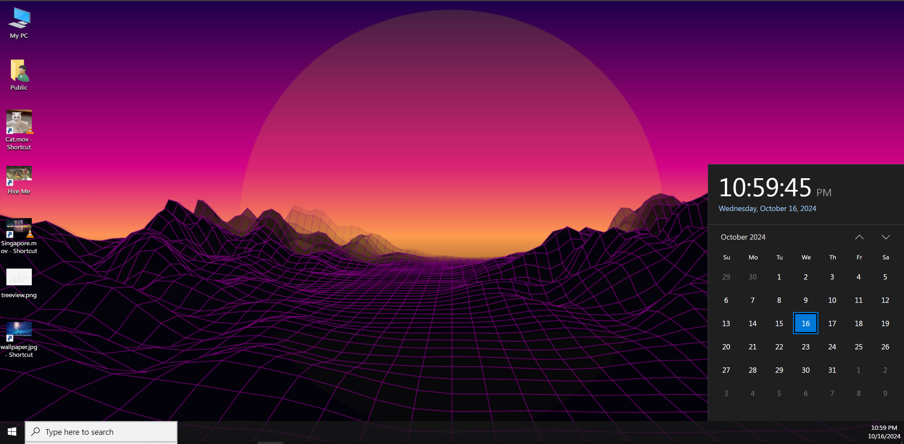
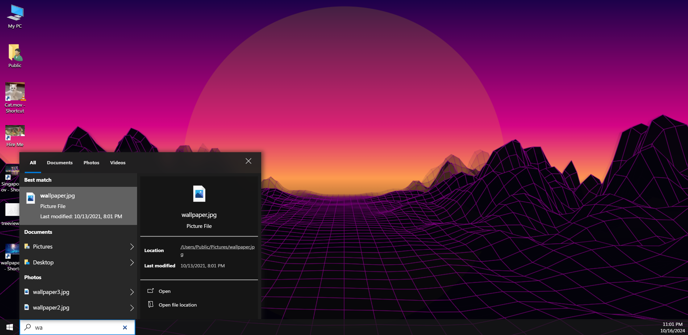
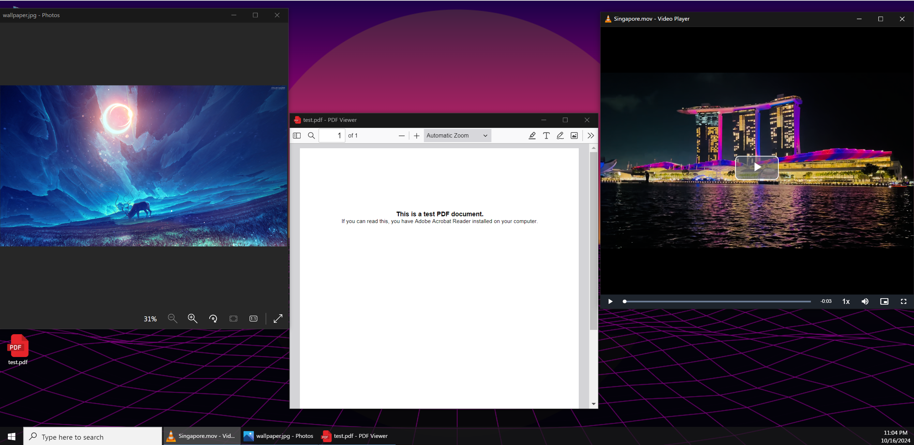
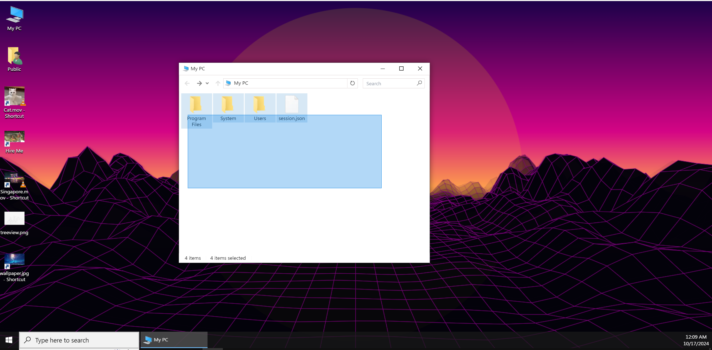
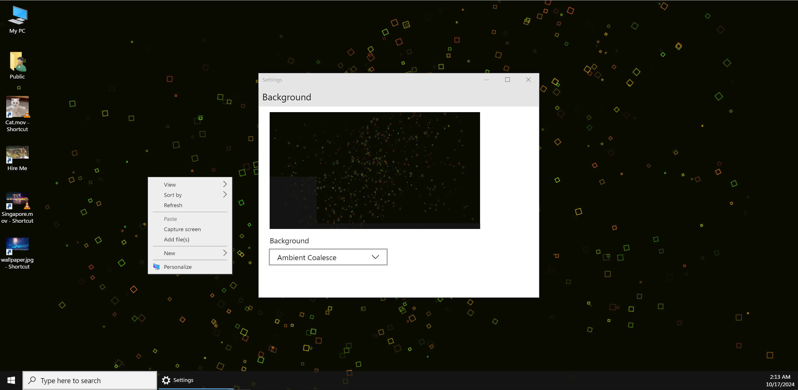

# WinSimulator

WinSimulator is a web app that replicates the appearance and functionality of Windows OS.

## Feature

- File system using [BrowserFS](https://github.com/jvilk/BrowserFS) write to [IndexDB](https://developer.mozilla.org/en-US/docs/Web/API/IndexedDB_API).
- Interactive folder, file and window (drag, drop, context menu, copy, delete, add, open, sort...).
- Interactive taskbar, calendar, clock, start menu.
- Search file index using [Lunr](https://lunrjs.com/).
- Wallpaper (picture, video, animation) using [WebWorker](https://developer.mozilla.org/en-US/docs/Web/API/Web_Workers_API/Using_web_workers) and [OffscreenCanvas](https://developer.mozilla.org/en-US/docs/Web/API/OffscreenCanvas)
- Apps (Photos Viewer, PDF Viewer, Video Player,...).

## Screenshots

  <div style="display: flex; flex-direction: column; gap: 12px">
  
  
  
  
  
  </div>

## Techs

#### Frameworks/Libraries

- [Next.js](https://github.com/vercel/next.js)
- [TypeScript](https://github.com/microsoft/TypeScript)
- [React](https://github.com/facebook/react)
- [BrowserFS](https://github.com/jvilk/BrowserFS)
- [Framer Motion](https://github.com/framer/motion)
- [Lunr](https://github.com/olivernn/lunr.js)
- [PDF.js](https://github.com/mozilla/pdf.js)
- [Video.js](https://github.com/videojs/video.js)
- [react-rnd](https://github.com/bokuweb/react-rnd)
- [html-to-image](https://github.com/bubkoo/html-to-image)
- [react-zoom-pan-pinch](https://github.com/BetterTyped/react-zoom-pan-pinch)
- [TailwindCSS](https://github.com/tailwindlabs/tailwindcss)

#### Deploy

- [AWS Amplify](https://aws.amazon.com/amplify/)

## Project structure

```
public/
┣ .index/..                <--- JSON data for file system, search, cache icon
┗ ...
scripts/
┣ cacheShortcuts.js        <--- Create url file JSON
┣ fs2json.js               <--- Create JSON file system JSON
┣ preloadIcons.js          <--- Create preload icons JSON
┣ searchExtensions.json    <--- Create search index options
┗ searchIndex.js           <--- Create search index
src/
┣ app/
┃ ┣ components/..
┃ ┣ error.tsx
┃ ┣ icon.ico
┃ ┣ layout.tsx
┃ ┗ page.tsx
┣ contexts/..              <--- State management
┣ hooks/..
┣ lib/..                   <--- Utils
┣ styles/..                <--- Global style
┗ react-app-env.d.ts
```

## Setup

```bash
$ git clone https://github.com/HoangTung25879/win-simulator.git
$ cd win-simulator
$ npm install
$ npm run build:prebuild
$ npm run dev
```

### Credits

WinSimulator is a fork of [daedalOS](https://github.com/DustinBrett/daedalOS). Custom for personal use.
Inspired by [awesome-os](https://github.com/zriyansh/awesome-os).

## License

[MIT](LICENSE)
